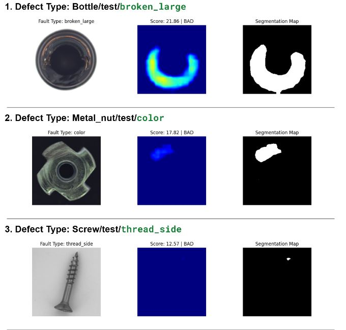

# Industrial_Anomaly_Detection-on-MVtec

## Overview

This project implements an anomaly detection system that:
- Extracts deep features from normal (good) images to build a memory bank
- Compares test images against this memory bank to detect anomalies
- Provides both image-level anomaly scores and pixel-level segmentation maps
- Evaluates performance using ROC-AUC metrics and confusion matrices

## Features

- **ResNet-50 Feature Extraction**: Uses pretrained ResNet-50 to extract robust visual features
- **Memory Bank Approach**: Stores normal image features for comparison
- **Dual-Level Detection**: Provides both image-level and pixel-level anomaly detection
- **Comprehensive Evaluation**: Includes ROC curves, confusion matrices, and F1 score optimization
- **Visualization Tools**: Generates heatmaps and segmentation maps for anomaly localization

## Requirements

```bash
pip install torch torchvision numpy matplotlib pillow tqdm scikit-learn opencv-python pathlib
```

## Dataset Structure

The code expects the MVTec AD dataset structure:
```
mvtec_anomaly_detection/
├── metal_nut/
│   ├── train/
│   │   └── good/           # Normal training images
│   └── test/
│       ├── good/           # Normal test images
│       ├── bent/           # Defective images (bent)
│       ├── color/          # Defective images (color)
│       ├── flip/           # Defective images (flip)
│       └── scratch/        # Defective images (scratch)
```

## Usage

### 1. Setup and Configuration

```python
import torch
from pathlib import Path

# Update paths to match your dataset location
train_path = Path('/path/to/mvtec_anomaly_detection/metal_nut/train/good')
test_path = Path('/path/to/mvtec_anomaly_detection/metal_nut/test')
```

### 2. Feature Extraction and Memory Bank Creation

The system automatically:
- Loads all normal training images
- Extracts features using ResNet-50 (layers 2 and 3)
- Creates a memory bank with 10% random sampling for efficiency
- Computes anomaly threshold using 3-sigma rule

### 3. Anomaly Detection

For each test image:
- Extracts patch-level features (28×28 patches)
- Computes minimum distance to memory bank for each patch
- Uses maximum patch distance as image-level anomaly score
- Creates segmentation map for anomaly localization

### 4. Evaluation and Visualization

The system provides:
- ROC-AUC scores for model performance
- Confusion matrices with optimal thresholds
- Anomaly heatmaps overlaid on original images
- Segmentation maps highlighting defective regions

## Key Components

### ResNet Feature Extractor
```python
class resnet_feature_extractor(torch.nn.Module):
    # Extracts features from ResNet-50 layers 2 and 3
    # Applies adaptive pooling and concatenation
    # Returns patch-level feature representations
```

### Memory Bank
- Stores concatenated features from all normal training images
- Randomly subsamples to 10% for computational efficiency
- Used as reference for anomaly detection

### Anomaly Scoring
- **Distance Metric**: Euclidean distance (L2 norm)
- **Patch-Level**: Minimum distance to memory bank per patch
- **Image-Level**: Maximum of all patch-level distances
- **Threshold**: μ + 3σ of normal image scores

## Performance Metrics

- **AUC-ROC**: Area under ROC curve for binary classification
- **F1 Score**: Harmonic mean of precision and recall
- **Confusion Matrix**: True/false positives and negatives
- **Threshold Optimization**: Best threshold based on F1 score

## Output Files
## Example Output



The system generates:
- Individual anomaly visualizations for each test image
- Comparative plots showing original image, heatmap, and segmentation
- Downloadable ZIP archive with all results
- Performance metrics and threshold analysis

## Example Results

For each test image, you'll see:
1. **Original Image**: Input test image
2. **Anomaly Heatmap**: Jet colormap showing anomaly intensity
3. **Segmentation Map**: Binary mask of detected anomalies
4. **Anomaly Score**: Numerical score and classification (GOOD/BAD)

## Customization

### Adjusting Sensitivity
```python
# Modify threshold multiplier (default: 3σ)
threshold = np.mean(y_score_good) + 2 * np.std(y_score_good)  # More sensitive
threshold = np.mean(y_score_good) + 4 * np.std(y_score_good)  # Less sensitive
```

### Memory Bank Size
```python
# Adjust sampling ratio (default: 10%)
sample_size = len(memory_bank) // 5  # Use 20% of features
sample_size = len(memory_bank) // 20  # Use 5% of features
```

### Feature Layers
```python
# Modify which ResNet layers to use
self.model.layer1[-1].register_forward_hook(hook)  # Earlier features
self.model.layer4[-1].register_forward_hook(hook)  # Later features
```

## Technical Details

- **Input Resolution**: 224×224 pixels (ResNet standard)
- **Patch Size**: 28×28 patches (784 total patches per image)
- **Feature Dimensions**: 391 features per patch (concatenated layer2 + layer3)
- **Memory Bank**: Stores ~30K patch features (10% of full training set)
- **Processing**: GPU-accelerated with CUDA support

## Troubleshooting

**Common Issues:**
- Ensure CUDA is available for GPU acceleration
- Verify dataset paths match your directory structure
- Check memory usage if processing large datasets
- Adjust batch processing if encountering memory errors

**Performance Optimization:**
- Reduce memory bank size for faster inference
- Use data loading with multiple workers
- Consider feature dimensionality reduction for very large datasets

## References

This implementation is based on the PatchCore paper and adapted for the MVTec Anomaly Detection dataset. The approach combines deep feature extraction with efficient memory bank comparison for robust anomaly detection in industrial settings.
